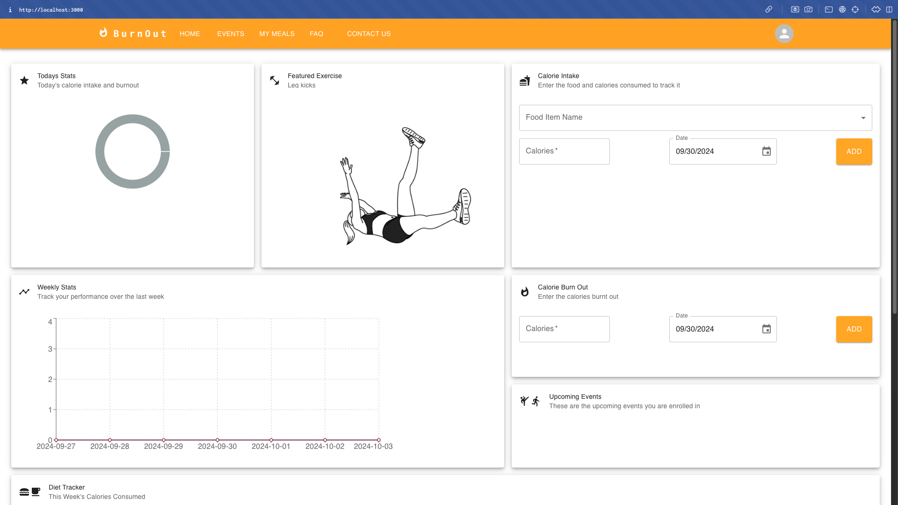
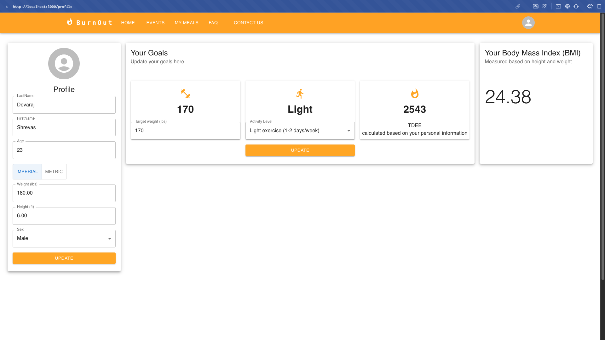

 

  
  <h3 align="center">BURNOUT</h3>
  

    Your daily health companion 🏃‍♀️
     
    <a href="https://aditikilledar.github.io/burnout-proj3/index.html"><strong>Explore the API docs »</strong></a>
     
     
    <a href="https://github.com/aditikilledar/burnout-proj3/blob/main/Tutorials.md">View Demo</a>
    ·
    <a href="https://github.com/aditikilledar/burnout-proj3/issues/new?assignees=&labels=&projects=&template=bug_report.md&title=">Report Bug</a>
    ·
    <a href="https://github.com/aditikilledar/burnout-proj3/issues/new?assignees=&labels=&projects=&template=feature_request.md&title=">Request Feature</a>
     
    <a href="https://youtu.be/bYTZT8vcICI">View Video</a>
    ·
    <a href="https://github.com/aditikilledar/burnout-proj3/blob/main/Project3Scores.md">Scores</a>
    ·
    <a href="https://github.com/aditikilledar/burnout-proj3/blob/main/Developer_README.md">Developer Documentation</a>
  

 

---

We forked this repo from this [link](https://github.com/aditikilledar/burnout-proj3)

### Team 96
#### Members
* Jinming Xing
* Krisha Patel
* Shreyas Devaraj

https://github.com/aditikilledar/burnout-proj3/assets/52149707/5873f399-194b-4a9c-85a4-db05b5c2e438

### Existing Features
- **Comprehensive Tracking**: Monitor everything from your diet to calories burned in one place.
- **Diverse Fitness Events**: Stay engaged with regularly updated fitness events to avoid routine monotony.
- **Personalized Insights**: Receive data-driven feedback to better understand your body and habits.
- **Community Support**: Connect with a like-minded community to share tips and stay motivated.
- **Data Security**: Ensure your data remains private and secure.

### Features to Add
- **Generative AI-Based Fitness Plan**: Create customized fitness plans using generative AI.
- **Chatbot Personal Assistant**: Provide a personal assistant chatbot for user guidance.
- **Food Image Analysis**: Analyze pictures of food items to assess their health impact.
- **Calendar Integration**: Connect with calendar apps to receive gym session reminders.
- **Dockerized Repository & Hosting**: Dockerize the project repository and host it publicly.
- **Fitness Buddies**: Integrate social media for connecting with fitness buddies.
- **Activity Tracker Integration**: Sync with activity trackers for seamless monitoring.

### Test Suite
Based on the provided code snippets, here's an overview of the test suite in the project:

1. Frontend Tests:
   - Tests rendering of each of the components, as present in [frontend/src/](frontend/src/) - for Home, Profile, Events, My-Meals, FAQs, Contact-Us etc

2. Backend Tests (`test_api.py`):
   The `APITestCase` class contains multiple test methods covering various API endpoints and scenarios:

   a. Authentication and Authorization:
   - `test_register_success`: Tests successful user registration.
   - `test_unauthorized_get_user_registered_events`: Tests unauthorized access to user's registered events.
   - `test_unauthorized_enrolled_true`: Tests unauthorized access to enrollment status.
   - `test_my_profile_unauthorized`: Tests unauthorized access to user profile.
   - `test_usersEvents_unauthorized`: Tests unauthorized access to user's events.
   - `test_foodCalorieMapping_unauthorized`: Tests unauthorized access to food calorie mapping.

   b. Event Management:
   - `test_get_events`: Tests fetching events.

   c. User Data Access:
   - `test_weekHistory_unauthorized`: Tests unauthorized access to week history.
   - `test_caloriesBurned_unauthorized`: Tests unauthorized access to calories burned data.
   - `test_goalsUpdate_unauthorized`: Tests unauthorized access to goals update.
   - `test_profileUpdate_unauthorized`: Tests unauthorized access to profile update.
   - `test_caloriesConsumed_unauthorized`: Tests unauthorized access to calories consumed data.

The test suite covers the following aspects:

1. Component Rendering: Ensures that key frontend components render without crashing.

2. API Endpoint Security: Extensively tests unauthorized access to various API endpoints, ensuring that protected routes are secure.

3. User Authentication: Tests the user registration process.

4. Data Retrieval: Tests fetching of events and other user-specific data.

5. User Actions: Tests various user actions like updating profile, goals, and accessing personal data.

6. Error Handling: Implicitly tests error responses for unauthorized access attempts.

While this test suite provides good coverage for authentication, authorization, and basic functionality, there are areas that could be expanded:

1. Positive test cases for authorized access to protected routes.
2. More comprehensive frontend testing, including user interactions and state management.
3. Testing of data manipulation endpoints (e.g., creating meals, enrolling in events).
4. Edge cases and error handling for valid but problematic inputs.
5. Integration tests that cover the interaction between frontend and backend.

Overall, the current test suite focuses heavily on security and unauthorized access, which is crucial, but could be expanded to cover more functional aspects of the application.

### Screenshot of the running application

#### Home page

#### Profile page

---

<a href="https://github.com/aditikilledar/burnout-proj3/stargazers" target="blank">

 
 

# Table of Contents  

- [Table of Contents](#table-of-contents)
  - [**🔥 Burnout: Elevate Your Health \& Fitness Game! 🔥**](#-burnout-elevate-your-health--fitness-game-)
- [**💡 Why Choose Burnout?**](#-why-choose-burnout)
- [Walkthrough](#walkthrough)
- [Application Screenshots](#application-screenshots)
  - [Sign-In](#sign-in)
  - [Homepage](#homepage)
  - [Profile](#profile)
  - [Events](#events)
  - [My-Meals](#my-meals)
  - [FAQs](#faqs)
  - [Contact-Us](#contact-us)
    - [:memo: **Note:** Additional screenshots and a mini tutorials can be found here:Tutorials.md](#memo-note-additional-screenshots-and-a-mini-tutorials-can-be-found-heretutorialsmd)
- [Project TechStack](#project-techstack)
- [Getting started](#getting-started)
    - [Prerequisites](#prerequisites)
- [What's new?](#whats-new)
- [Bug Fixes](#bug-fixes)
- [Future Scope](#future-scope)
- [Contributors](#contributors)
- [Contribution](#contribution)
- [License](#license)

## **🔥 Burnout: Elevate Your Health & Fitness Game! 🔥**
 
Are you determined to achieve your dream physique? Desiring to take charge of your health? Looking for a platform that offers everything from calorie counting to enrolling in exciting fitness events? Welcome to **Burnout** – the only health and fitness companion you'll ever need.
 
- **🍎 Nutrition Made Simple:**
Navigating the complex world of nutrition can be daunting. With Burnout, you can effortlessly track what you eat and gain insights into your calorie consumption. Whether you're having a quick salad or indulging in a cheat meal, every bite counts. And we're here to count it for you!
 
- **🔥 Ignite Your Calorie Burn:**
Exercise isn't just about looking good; it's about feeling good too. Track every step taken, every calorie burned, and every drop of sweat shed. Watch yourself progress as Burnout pushes you to achieve your health goals.
 
- **🏊 Dive into Exciting Fitness Events:**
Bored of your routine workout? Dive into an array of fitness events – from calming yoga sessions to adrenaline-pumping gym workouts. Whether you're into swimming, walking, or exploring new activities, there's something for everyone. Get social, challenge yourself, and discover activities you love.
 
- **📊 Tailored To You:**
Everyone's health journey is unique. Input your age, current weight, height, target weight, and goals, and let Burnout craft a personalized plan for you. Watch in real-time as you inch closer to your goals and celebrate each milestone with us.
  
So, are you ready to take the leap towards a healthier, happier you? Dive into **Burnout** now and elevate your fitness game!
 
🔥 *Because it's not just about burning calories; it's about burning doubts, burning procrastination, and lighting up confidence!* 🔥

# **💡 Why Choose Burnout?**
 
- **Comprehensive Tracking:** From what you eat to how much you burn, monitor everything in one place.
  
- **Diverse Fitness Events:** Never fall into the monotony of routine. Stay excited about fitness with new events to join regularly. 
  
- **Personalized Insights:** Understand your body and habits better with data-driven feedback.
  
- **Community Support:** Engage with a like-minded community, exchange tips, and stay motivated.
  
- **Security:** Your data is precious, and we guard it like our own. Rest assured, your information stays private and secure.
 
In today's fast-paced world, maintaining health is a challenge. But with the right tools and community, this challenge becomes an enjoyable journey. And Burnout is here to make sure of that.

# Walkthrough

Link to the implementation video of the BurnOut application: [Video](https://www.youtube.com/watch?v=Ozbn9nNFr1Y)

# Application Screenshots
 
 ## Sign-In
 

 ## Homepage
 

 ## Profile
 

 ## Events

 ## My-Meals

 ## FAQs

 ## Contact-Us

### :memo: **Note:** Additional screenshots and a mini tutorials can be found here:[Tutorials.md](https://github.com/aditikilledar/burnout-proj3/blob/main/Tutorials.md)

# Project TechStack

  React  
  MongoDB  
  Python  

 # Getting started
 
Follow these steps to set up and run the application on your local machine.

### Prerequisites
Before you begin, make sure you have the following installed:

- [Python](https://www.python.org/downloads/)
- [Node.js](https://nodejs.org/en/download)
- [MongoDB](https://docs.mongodb.com/manual/tutorial/install-mongodb-on-windows)
 
 Step 1: 
  Git Clone the Repository 
  
    git clone https://github.com/aditikilledar/burnout-proj3

Step 2:
   Ensure mongodb is running and execute the below to populate the tables:
   Navigate to the backend folder.

    cd backend

  Once in the backend, go to the `db` folder run:
  
    python insert_event_data.py
    python insert_food_data.py

 Step 3:
   Remain in the backend folder and run the following command to start the server:
    
    pip install -r requirements.txt
    flask run

 Step 4:
   Navigate to the frontend folder and run the below to start the React app:
    
    cd frontend
    npm install 
    npm start
    
 Step 5:
    Open the URL in your browser:  
      http://127.0.0.1:3000
      
# What's new?

This version enhanced and built on the previous version, making it 10x more interesting and easier to use!
Here's what we added in this release.

1. Ability to add custom foods and track their calories.
2. Fully customizable meal creation.
3. An intuitive and searchable dropdown.
4. BMI Calculation for your personal profile.
5. Intelligent automatic calorie burn calculation.
6. Enhanced UI.
7. Randomized Exercise of the Day.
8. Google Sign-in is now an option!
9. Better progress tracking on the landing page.

# Bug Fixes
We fixed many bugs, but here are the most notable ones...

1. Sign up / Sign in issues, especially when an existing user tries to sign up again.
2. The proxy in the config files were wrong, making it difficult to run the website. Proxy issues were fixed.
3. Testcases were updated and fixed.
4. Event were not un-enrollable. Now events can be enrolled and unenrolled.
5. Exercise of the day was static, which defeats the purpose. Fixed, it is now random.
6. Linechart on the landing page was incorrect. Fixed.

# Future Scope
The application can be extended with features like:

1. Counting macros.
2. Adding a chat bot/assistant.
3. Linking with an activity tracker like fitbit.
4. Provides standard diet plans.
5. Dockerize the application.
6. Taking the user's medical history into account.
7. Finding fitness buddies. (Integrating social media)
   
   # Contributors
   

  <table>
    <tr>
    <td align="center"><a href="https://github.com/XingJinming-real"> <b>Jinming Xing</b></a> </td>
    <td align="center"><a href="https://github.com/krishapatel10"> <b>krisha patel</b></a> </td>
    <td align="center"><a href="https://github.com/shreyasdvrj"> <b>Shreyas Devaraj</b></a> </td>
        <td align="center"><a href="https://github.com/aiyer786"> <b>Aditya Iyer</b></a> </td>
      <td align="center"><a href="https://github.com/aditikilledar"> <b>Aditi Killedar</b></a></td>
    <td align="center"><a href="https://github.com/shashank-madan"> <b>Shashank Madan</b></a> </td>
      <td align="center"><a href="https://github.com/srina1h"> <b>Srinath Srinivasan</b></a> </td>
    </tr>
  </table>

  # Contribution
  
  Please refer the [CONTRIBUTING.md](https://github.com/adi-kiran/burnout-healthgoalsapp/blob/main/CONTRIBUTING.md) file for instructions on how to contribute to our repository.

  # License
  
  This project is licensed under the MIT License. Please refer to [LICENSE](https://github.com/adi-kiran/burnout-healthgoalsapp/blob/main/LICENSE) for more details.
  
  

